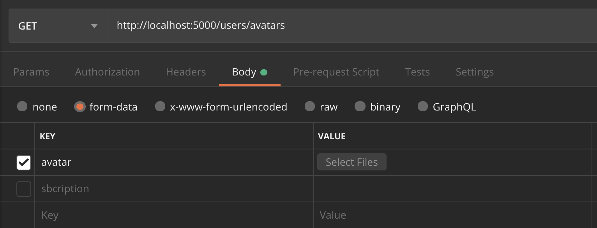

**Читати на інших мовах: [Русский](README.md), [Українська](README.ua.md).**

# Домашнє завдання 5

Створи гілку `hw05-avatars` з гілки ` master`.

Продовж створення REST API для роботи з колекцією контактів. Додай можливість завантаження аватарки користувача через [Multer] (https://github.com/expressjs/multer).

## Крок 1

Створи папку `public` для роздачі статики. У цій папці зроби папку `avatars`. Налаштуй Express на роздачу статичних файлів з папки `public`.

Поклади будь-яке зображення в папку `public/avatars` і перевір, що роздача статики працює. При переході по такому URL браузер відобразить зображення.

`` `Shell http://locahost:<порт>/avatars/<ім'я файлу з розширенням> `` `

## Крок 2

У схему користувача додай нову властивість `avatarURL` для зберігання зображення.

```shell
{
  ...
  avatarURL: String,
  ...
}
```

- Використовуй пакет [gravatar](https://www.npmjs.com/package/gravatar) для того, щоб при реєстрації нового користувача відразу згенерувати йому аватар по його `email`.

## Крок 3

При реєстрації користувача:

- Створюй посилання на аватарку користувача за допомогою [gravatar](https://www.npmjs.com/package/gravatar)
- Отриманий URL збережи в поле `avatarURL` під час створення користувача

## Крок 4

Додай можливість поновлення аватарки, створивши ендпоінт `/users/avatars` і використовуючи метод` PATCH`.



```shell
# Запит
PATCH /users/avatars
Content-Type: multipart/form-data
Authorization: "Bearer {{token}}"
RequestBody: завантажений файл

# Успішна відповідь
Status: 200 OK
Content-Type: application/json
ResponseBody: {
  "avatarURL": "тут буде посилання на зображення"
}

# Неуспішна відповідь
Status: 401 Unauthorized
Content-Type: application/json
ResponseBody: {
  "message": "Not authorized"
}
```

- Створи папку `tmp` в корені проекту і зберігай в неї завантажену аватарку.
- Оброби аватарку пакетом [jimp](https://www.npmjs.com/package/jimp) і постав для неї розміри 250 на 250
- Перенеси аватарку користувача з папки `tmp` в папку `public/avatars` і дай їй унікальне ім'я для конкретного користувача.
- Отриманий `URL` `/avatars/<ім'я файлу з розширенням>` та збережи в поле `avatarURL` користувача

## Додаткове завдання - необов'язкове

### 1. Написати unit-тести для контролера входу (login/signin)

За допомогою [Jest](https://jestjs.io/ru/docs/getting-started)

- відповідь повина мати статус-код 200
- у відповіді повинен повертатися токен
- у відповіді повинен повертатися об'єкт `user` з 2 полями `email` та `subscription` з типом даних `String`

