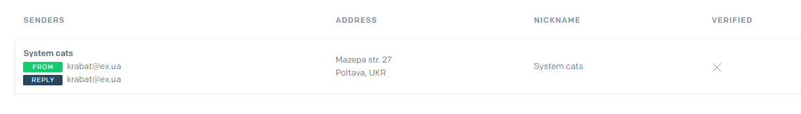
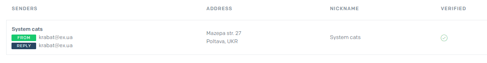
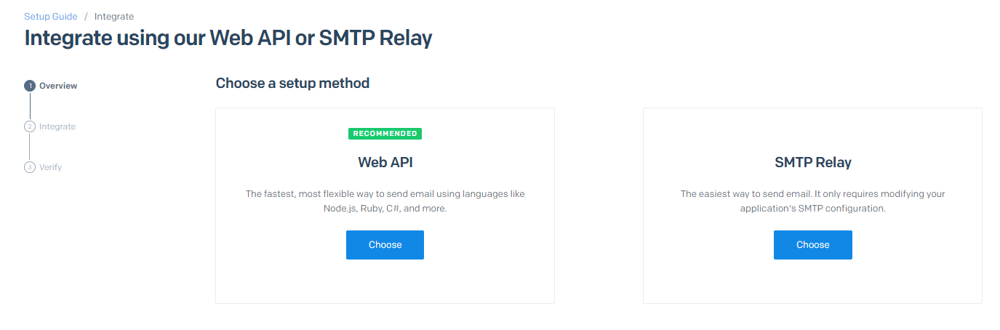
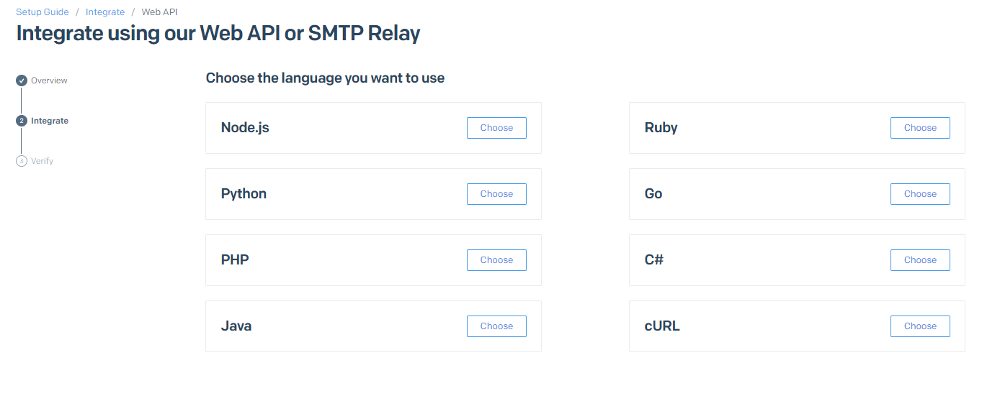
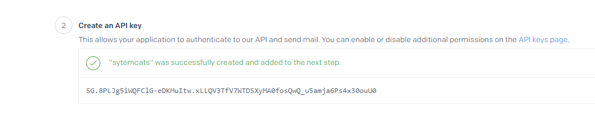

**Leer en otros idiomas: [Русский](README.md), [Українська](README.ua.md).**

# Tarea 6

Crea una rama `hw06-email` de la rama `master`.

Continuamos construyendo la API REST para la manipulación de colecciones de contactos. Añade la verificación del email del usuario después de registrarse, mediante el servicio [SendGrid](https://sendgrid.com/).

## Cómo debe funcionar el proceso de verificación

1. Después de registrarse, el usuario debería recibir un mensaje de correo electrónico en la dirección facilitada durante el registro con un enlace para verificar su email
2. Al seguir el enlace en el correo recibido la primera vez, el usuario debería recibir una [Respuesta con el estado 200](#verification-success-response), lo que significaría la verificación exitosa del correo electrónico
3. Al seguir de nuevo el enlace, el usuario debería recibir [Error con el estado 404](#verification-user-not-found)

## Paso 1

### Preparando la integración con SendGrid API

- Regístrate en [SendGrid](https://sendgrid.com/).
- Crea un remitente de correo electrónico. Para ello, en el panel de administración de SendGrid, vaya al menú Marketing en el submenú senders y en la esquina superior derecha haz clic en "Create New Sender". Rellena los campos obligatorios del formulario propuesto. Guárdalo. Deberías obtener el siguiente resultado como en la imagen, sólo que con tu email:



Debería enviarse un correo de verificación al email especificado (comprueba el correo no deseado si no lo ves). Haz clic en el enlace que aparece en él y completa el proceso. El resultado debería cambiar a:



- Ahora necesitas crear un token de acceso a la API. Selecciona el menú "Email API" y el submenú "Integration Guide". Aquí seleccione "Web API"



A continuación, seleccione la tecnología Node.js



En el tercer paso, le damos un nombre a nuestro token. Por ejemplo, systemcats, pulse el botón de generar y obtenga el resultado como se muestra en la captura de pantalla siguiente. Tienes que copiar este token (esto es importante porque no podrás volver a verlo). Después de completar el proceso de creación del token



- El token de la API obtenido debe añadirse al archivo `.env` de nuestro proyecto

## Paso 2

### Creación de un endpoint para la verificación del email

- añade dos campos `verificationToken` y `verify` al modelo `User`. Si el valor del campo `verify` igual a `false` significa que su correo electrónico aún no ha sido verificado.

```js
{
  verify: {
    type: Boolean,
    default: false,
  },
  verificationToken: {
    type: String,
    required: [true, 'Verify token is required'],
  },
}
```

- crea el endpoint GET [`/users/verify/:verificationToken`](#verification-request), donde para buscar un usuario en el modelo `User` se utilizaremos el parámetro `verificationToken`
- si no se encuentra un usuario con este token, debe devolver [Error 'Not Found'](#verification-user-not-found)
- si el usuario es encontrado, se establece `verificationToken` a `null` y se establece el campo `verify` a `true` en el documento del usuario, y se devuelve [Успешный ответ](#verification-success-response)

### Verification request

```shell
GET /auth/verify/:verificationToken
```

### Verification user Not Found

```shell
Status: 404 Not Found
ResponseBody: {
  message: 'User not found'
}
```

### Verification success response

```shell
Status: 200 OK
ResponseBody: {
  message: 'Verification successful',
}
```

## Paso 3

### Añadir el correo electrónico al usuario con un enlace de verificación

Al crear un usuario durante el registro:

- se crea `verificationToken` para el usuario y se escribe en la base de datos (para generar el token, utilice el paquete [uuid](https://www.npmjs.com/package/uuid) o [nanoid](https://www.npmjs.com/package/nanoid))
- Se envía un correo electrónico al usuario y se proporciona un enlace para verificar el email (`/users/verify/:verificationToken`) en el mensaje
- También hay que tener en cuenta que ahora no se permite el inicio de sesión del usuario si el correo electrónico no está verificado

## Paso 4

### Realizar un reenvío del correo al usuario con el enlace de verificación

Es posible que el usuario pueda borrar accidentalmente el correo electrónico. Puede que no llegue al destinatario por alguna razón, o que nuestro servicio de envío de correos electrónicos haya tenido un error durante el registro, etc.

#### @ POST /users/verify/

- Recibe `body` en formato `{ email }`
- Si en `body` no existe el campo obligatorio `email`, devuelve un json con la llave `{"message": "missing required field email"}` y el estado `400`
- Si en `body` todo está bien, reenviamos el correo electrónico con un `verificationToken` al email especificado, pero sólo si el usuario no está verificado
- Si el usuario ya ha sido verificado, envía un json con la llave `{ message: "Verification has already been passed"}` con el estado `400 Bad Request`

#### Resending a email request

```shell
POST /users/verify
Content-Type: application/json
RequestBody: {
  "email": "example@example.com"
}
```

#### Resending a email validation error

```shell
Status: 400 Bad Request
Content-Type: application/json
ResponseBody: <Ошибка от Joi или другой библиотеки валидации>
```

#### Resending a email success response

```shell
Status: 200 Ok
Content-Type: application/json
ResponseBody: {
  "message": "Verification email sent"
}
```

#### Resend email for verified user

```shell
Status: 400 Bad Request
Content-Type: application/json
ResponseBody: {
  message: "Verification has already been passed"
}
```

> Nota: Como alternativa a SendGrid, puede utilizar el paquete [nodemailer](https://www.npmjs.com/package/nodemailer)

## Tarea adicional (opcional)

### 1. Escriba un dockerfile para su aplicación

